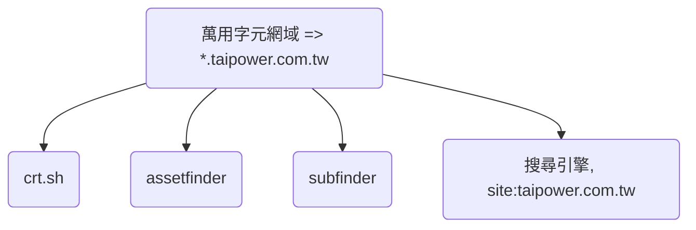
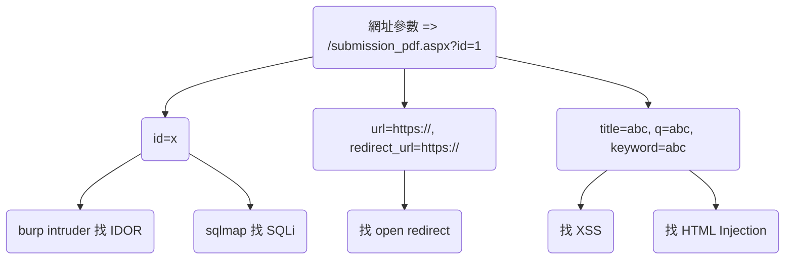
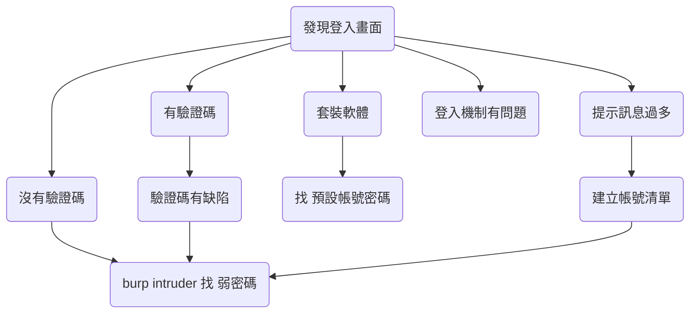

# 白帽流程圖

### 找出所有範圍內的子網域

```mermaid
flowchart TD
    id1(萬用字元網域 => *.taipower.com.tw) --> id101(crt.sh)
    id1 --> id102(assetfinder)
    id1 --> id103(subfinder)
    id1 --> id104(搜尋引擎, site:taipower.com.tw)
```

### 觀察網址參數

```mermaid
flowchart TD
    id1(網址參數 => /submission_pdf.aspx?id=1) --> id101("id=x")
    id1 --> id102("url=https://, redirect_url=https://")
    id1 --> id103("title=abc, q=abc, keyword=abc")
    
    id101 --> id10101(burp intruder 找 IDOR)
    id101 --> id10102(sqlmap 找 SQLi)
    
    id102 --> id10201("找 open redirect")
    
    id103 --> id10301("找 XSS")
    id103 --> id10302("找 HTML Injection")
```

### 發現登入畫面

```mermaid
flowchart TD
    id1(發現登入畫面) --> id101(沒有驗證碼)
    id1 --> id102(有驗證碼)
    id1 --> id103(套裝軟體)
    id1 --> id104(提示訊息過多)
    id1 --> id105(登入機制有問題)
    
    id101 --> id10101(burp intruder 找 弱密碼)
    id102 --> id10201(驗證碼有缺陷)
    id10201 --> id10101
    id103 --> id10301(找 預設帳號密碼)
    id104 --> id10401(建立帳號清單)
    id10401 --> id10101
```
